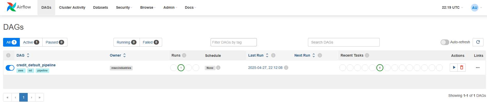

# Credit Default Prediction - End-to-End MLOps Pipeline (MSEC Industries)

## 🎯 Project Scope Clarification

This project focuses on building a robust end-to-end MLOps pipeline, rather than producing a fully optimized or production-ready machine learning model. The pipeline showcases how key components—data ingestion, preprocessing, training, evaluation, and quality gating—can be automated and orchestrated using Airflow, Lambda, and SageMaker.

Advanced ML practices such as hyperparameter tuning, cross-validation, and train/validation/test splits are not yet implemented, and the current evaluation is based solely on training accuracy. Similarly, while the design anticipates integration with a feature store and deployment to a SageMaker endpoint, these components are not yet included. The primary objective is to demonstrate the pipeline's structure, automation, and extensibility.

## 🛠️ Project Overview

Built a complete end-to-end Machine Learning pipeline using **Apache Airflow**, **AWS Lambda**, **SageMaker**, and **S3**, designed for retraining, evaluation, and deployment control of an XGBoost model predicting credit card default risk.

The pipeline enforces **model quality gates**, ensuring only models that meet a minimum performance threshold are eligible for deployment.

---

## 🌐 Technologies Used

- **Apache Airflow 2.8.1** (Docker Compose, LocalExecutor)
- **AWS Lambda** (Data ingestion and preprocessing)
- **AWS S3** (Data storage: raw, cleaned, training datasets, model artifacts)
- **AWS RDS Postgres** (Customer profile database)
- **AWS SageMaker** (Managed model training)
- **Python 3.8**
- **Libraries**: `boto3`, `pandas`, `scikit-learn`, `joblib`

---

## 🗂️ Project Structure

```plaintext
/dags/
    credit_default_pipeline.py           # Main DAG
/jobs/
    launch_credit_xgb_training_job.py    # SageMaker training job launcher
    evaluate_credit_xgb_model_job.py     # Model evaluation script
/requirements.txt                        # Python dependencies
/docker-compose.yml                      # Airflow + PostgreSQL + volumes setup
```

---

## 📊 Data Preparation

- **Original Dataset**: [UCI Credit Card Default Dataset](https://archive.ics.uci.edu/ml/datasets/default+of+credit+card+clients)
- **Preprocessing**:
  - Added a `CUSTOMER_ID` column to simulate join keys.
  - Standardized column names (spaces → underscores, dots removed, all uppercase).
  - Split into two data sources:
    - **Transaction Features** (to S3)
    - **Profile Features** (to RDS PostgreSQL)

---

## 🫳 S3 Buckets and Folder Structure

| Bucket                    | Purpose                            | Example Path                                                                               |
| ------------------------- | ---------------------------------- | ------------------------------------------------------------------------------------------ |
| `msecindustries-raw`      | Raw ingestion files                | `s3://msecindustries-raw/source1/credit_default_s3_raw.csv`                                |
| `msecindustries-cleaned`  | Cleaned sources from Lambda        | `s3://msecindustries-cleaned/cleaned-source1/`                                             |
| `msecindustries-training` | Final merged training dataset      | `s3://msecindustries-training/final-dataset/credit_default_final_training.csv`             |
| `msecindustries-models`   | SageMaker training model artifacts | `s3://msecindustries-models/xgboost-model-artifacts/{TrainingJobName}/output/model.tar.gz` |

---

## 🛠️ AWS Lambda Functions

- `msecindustries-ingest-clean-s3-raw`: Clean raw S3 transaction data.
- `msecindustries-ingest-clean-rds`: Clean customer profile data from RDS.
- `msecindustries-merge-prep-train-data`: Merge S3 + RDS cleaned datasets into final training-ready format.

**All Lambda functions are triggered by Airflow tasks.**

---

## 🧐 SageMaker Training Configuration

- **Algorithm**: SageMaker built-in XGBoost container
- **Training Instance**: `ml.m5.xlarge`
- **Output Path**: `s3://msecindustries-models/xgboost-model-artifacts/{TrainingJobName}/output/model.tar.gz`
- **Training Hyperparameters**:
  ```python
  objective='binary:logistic'
  num_round=100
  max_depth=5
  eta=0.2
  gamma=4
  min_child_weight=6
  subsample=0.8
  ```
- **Training Data Input**:
  - `s3://msecindustries-training/final-dataset/credit_default_final_training.csv`
- **Monitoring**:
  - `wait_for_training_job()` function polls SageMaker for job status until success or failure.

---

## 📈 Model Evaluation and Quality Gate

After SageMaker training:

- Download the trained `model.tar.gz` from the dynamic S3 path.
- Extract and load the model.
- Predict on the **training dataset** (future validation split ready).
- Calculate **accuracy**.
- **Fail the pipeline** if model accuracy < 80%.

**Threshold Check Logic:**

```python
if acc < 0.80:
    raise ValueError(f"Model accuracy {acc:.4f} is below threshold!")
```

✅ Ensures only high-quality models are accepted.

---

## 👋 Full Airflow DAG Flow

```plaintext
check_lambda_connection
        ↓
invoke_clean_s3_raw
        ↓
invoke_clean_rds
        ↓
invoke_merge_cleaned_data
        ↓
start_sagemaker_training
        ↓
evaluate_model_performance
```

- **Retries**: 1 retry for transient failures
- **Timeouts**: 10-minute execution timeout per task
- **XCom**: Used to pass training job name from training → evaluation task

---

## 🚀 Key Features

- Full AWS service orchestration (Lambda, S3, SageMaker) from Airflow.
- Model training and evaluation are **modular and decoupled**.
- Automatic **model quality gating** based on evaluation thresholds.
- Dynamic handling of model artifacts based on training job ID.
- Resilient retry and timeout settings for production stability.

---

## 📚 Potential Future Enhancements

- Deploy validated models automatically to **SageMaker Endpoints**.
- Store model evaluation results in **DynamoDB** or **RDS** for auditability.
- Implement notifications via **SNS** or **Email** on training or evaluation failure.
- Add a **proper train/validation/test split** for more robust evaluation metrics.
- Register models to **SageMaker Model Registry** for lifecycle management.

---

## 🌟 Project Outcome

Delivered a **cloud-native, fully-automated MLOps pipeline** that ingests raw data, processes it, trains models, evaluates model quality, and enforces gates before moving to deployment. Built for **scalability**, **automation**, and **future extensibility** to production ML systems.

## Latest Results


